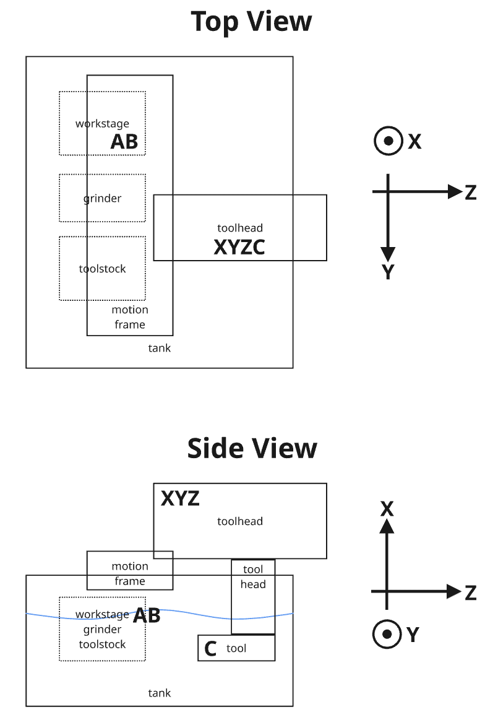
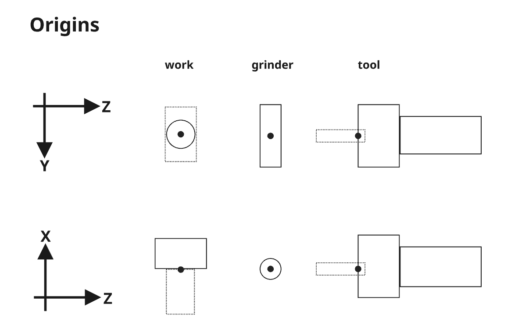

# G-code Spec

## Machine Geometry

The spark machine has following mandatory component
* tool
  * required: X,Y,Z translational axes
  * optional: C axis
* work
  * optional: A, B rotaty axes
* grinder
  * controlled by M-code; no coordinate value (TBD)

X, Y, Z has origin (axis limit switch).
C does not have origin, thus not homaeble (whtaever bootup rotation become "origin").
A, B is undecided. (not yet supported)

We have 4 coordinate systems based on these origins:
* Machine coordinate system (default on boot; G53)
  * coordinates = tool origin wrt. machine origin
* Grinder coordinate system (G54)
  * coordinates = tool origin wrt. grinder origin
* Work coordinate system (G55)
  * coordinates = tool origin wrt. work origin
* Tool supply coordinate system (G56)
  * coordinates = TBD

We do not provide "tool center point control".
Management of current tool shape is G-code programs' responsibility.

### Standard Configuration
For now, we have only one configuration of axes and we call it "standard".
G-code, the firmware, and the software should be flexible enough to allow different configurations in future.





## Overall Syntax
* No comment allowed
  * Host must strip them (to save bandwidth & ease error reporting)
  * But we do use `; ...` to mean comment in docs
* No lowercase allowed (unlike RS274/NGC)
  * Error: `g0 x0`
  * To keep design wiggle room for wire protocol design
* No "line" vs "block" distinction; coordinate change is sequence of commands
  * Error: `G54 G0 Y10`
  * Good: `G54` (change coord sys) then `G0 Y10` (move)
    * Coord change affects all following commands until further coordinate system change

## Numbers
Float numbers are decimal. Both signs (+/-) are allowed. Exponents are not allowed.

* Valid: `+1.32`, `-0.04`, `.500`
* Invalid: `05`, `1e3`, `inf`, `1+0.5`

For translational axes, they mean mm.
For rotational axes, they mean degree.
Rotations mean same thing if they're equal under modulo 360.


## Supported G-codes

### G0: Fast move
Parameters: X, Y, Z, C (all optional, but at least one required)

Examples:
```
G0 X12.3
G0 Z123.5 Y-23.5
G0 X10 Y20 C45.5  ; Move with tool rotation

G0  ; error
```

### G1: Controlled EDM move
Parameters: X, Y, Z, C (all optional, but at least one required)

Automatically energizes pulser at start and de-energizes at completion.
Uses parameters configured by M3/M4, or defaults if not configured.

Examples:
```
G1 X10 Y20
G1 Z-5 C90  ; Move with tool rotation
G1 X5 Y10 Z15 C180  ; Move all axes

G1  ; error
```

### G28: Home
Parameters: X, Y, Z (none or just one parameter allowed)

Examples:
```
G28  ; home all-axis according to the settings
G28 X  ; home X-axis

G28 X Y  ; error
G28 X10  ; error
```

Coordinates of homed axes will be set to origin value configured by
`a.{x,y,z}.home.origin`.

When all-axis homing (`G28`) is instructed, `a.{x,y,z}.home.phase` will
be used for grouping and ordering of axes.

### G38.3: Probe towards target, no error
Parameters: X, Y, Z, C (all optional, but at least one required)

Automatically energizes pulser at start and de-energizes when probe triggers or motion completes.
Uses parameters configured by M3/M4, or defaults if not configured.

Examples:
```
G38.3 X10 Y3.5

G38.3  ; error
```

### G53: Use machine coordinate system
Interpret following commands' coordinates in machine coordinate system.
Machine coordinate system is the default coordinate system after reboot.

### G54: Use grinder coordinate system
Interpret following commands' coordinates in grinder coordinate system.

### G55: Use work coordinate system
Interpret following commands' coordinates in work coordinate system.

### G56: Use tool supply coordinate system
Interpret following commands' coordinates in tool supply coordinate system.

## Supported M-codes

### M3: Configure EDM parameters, tool negative voltage
Parameters: P (pulse time in µs), Q (current in A), R (duty cycle %)

Configures EDM parameters but does not energize. Energization occurs automatically during G1 and G38.3 moves.

Default values:
- P: 500µs
- Q: 1.0A  
- R: 25%

Examples:
```
M3              ; Use all defaults
M3 P750 Q1.5    ; 750µs pulses, 1.5A current, default duty
M3 Q2.0 R30     ; 2A current, 30% duty, default pulse time
```

### M4: Configure EDM parameters, tool positive voltage
Parameters: P (pulse time in µs), Q (current in A), R (duty cycle %)

Configures EDM parameters but does not energize. Energization occurs automatically during G1 and G38.3 moves.

Default values same as M3.

Examples:
```
M4              ; Use all defaults
M4 P1000 Q0.8   ; 1000µs pulses, 0.8A current, default duty
```

### M8: Start pump
Parameters: none

Start water filter pump.

### M9: Stop pump
Parameters: none

Stop water filter pump.

### M10: Start grinder wire feeding
Parameters: R (feed rate in mm/min, required)

Starts grinder wire feeding and wait until tension stabilizes.

Examples:
```
M10 R120 ; start with wire feed rate of 120mm/min
```

### M11: Stop grinder wire feeding
Parameters: None

Examples:
```
M11  ; Stop wire feed
```
